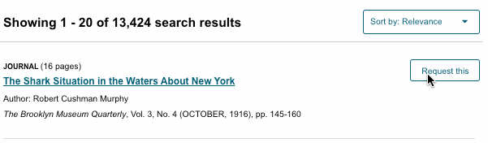
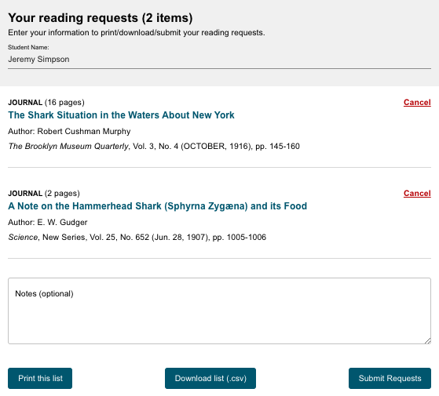

## How to use JSTOR
JSTOR supports full-text keyword searching across all of the content. JSTOR generally includes all the content from articles, books, and pamphlets, cover to cover. This makes it possible to search front matter and back matter, letters to the editor, advertisements, and other types of material along with scholarly articles and book chapters. 

### Search JSTOR
The search form appears on the main page and also at the top of most content pages. You can type any search terms into the box and JSTOR will search for those terms across all of the content on the index.

Here are a few things you can do to easily improve your search results:

* Place words within quotation marks to search for exact phrases (“to be or not to be”).
* Use Boolean operators to search for alternate terms (microcredit OR microfinance).
* Use ti: to search for the title of an article or book (ti:"body ritual among the nacirema")

While we call the simple search box a "Basic Search," you can perform fairly complex queries with it using special codes and Boolean operators. These options are explained in more detail below.

*The main search entry box for the JSTOR Offline Index. Type your search terms here and then click on the magnifying glass to do your first search.*

### Combining Search Terms & Boolean Logic
You may combine search terms and fields using AND, OR, and NOT (Boolean logic).

AND: When you combine search terms with AND in a search, your results contain everything in which both terms appear. Combining search terms makes your search results more precise. You can explicitly denote AND in the following ways: cat AND dog, cat && dog, +cat +dog, (cat dog)

OR: Using OR between search terms allows you to find all items that contain either term. Using OR will search for items that contain either the word "cat", the word "dog", or both. For example: cat OR dog

NOT: Searches using NOT will only find items that do not contain the search term following it. NOT must be capitalized. To find all items with the word cat that do not contain the word dog, search for: cat NOT dog, cat -dog (Be sure to include a space before the dash, but not after). 

#### Grouping Combined Search Terms

Parentheses allow you to determine the order in which terms are combined. The search "currency reform" AND (russia OR "soviet union") will search for items that contain the phrase currency reform and that contain either russia or soviet union. Without grouping parentheses, the search is interpreted as "currency reform" AND russia OR "soviet union," which returns items containing either both currency reform and russia or containing soviet union. By using parentheses, you may control the grouping of search terms.

#### Additional examples:

* (finch OR sparrow) AND exotic will search for items that contain the word exotic and either the word finch or the word sparrow
* (birds OR butterflies) NOT sparrow will search for items that contain either the word birds or butterflies and do not contain the word sparrow
* birds NOT (sparrow AND robin) will search for items that contain the word birds but do not contain both the words sparrow and robin
* birds NOT (sparrow OR robin) will search for items that contain the word birds but do not contain either the word sparrow or the word robin

### Searching for an exact phrase
If you want to include more than one term in a field search, use parentheses () to enclose your search terms, or quotation marks (" ") to search for an exact phrase. The example above ("american revolution") searches for the exact phrase "american revolution" rather than treating it as a keyword search (american AND revolution).

Some other examples:

* ti:cat dog will find the word cat in the item title field and the word dog in any field  
* ti:(cat dog) will find the words cat and dog in the item title field in any order 
* ti:"color purple" will find the exact phrase color purple in the item title field
* ti:(peacekeeping AND "united nations") will find the word peacekeeping and the phrase united nations in the item title field

### Searching for Multiple Spellings of a Word
Using the tilde symbol: You can find words with spellings similar to your search term by using the tilde ( ~ ) symbol at the end of a search term. For example, ti:dostoyevsky~ helps find items with dostoyevsky in the item title field, as well as variant spellings like dostoevsky, dostoievski, dostoevsky, dostoyevski, dostoevskii, dostoevski, etc. Note: This way of searching encompasses a very large number of words. Narrowing this kind of search to the item title or another field is recommended. The first letter always remains the same.

Wildcards: Wildcards take the place of one or more characters in a search term. A question mark is used for single character searching. An asterisk is used for multiple character searching. Wildcards are used to search for alternate spellings and variations on a root word. Wildcard characters cannot be used in place of the first letter of a word or within an exact phrase search. For example:

**wom?n** finds the words woman, women, womyn 
**bird*** finds bird, birding, birdman, birds, and other words that start with bird 
**organi?ation** finds organization or organisation<brb />
**behavior*** searches for behavior, behavioral, behaviorist, behaviorism, or behaviorally 

You can combine search terms containing wild cards (wom?n AND "science education") and they may be used in a field search: au:sm?th or ti:shakespeare*

### Proximity searching
JSTOR search allows you to find terms that are within a set number of words of each other using the tilde (~) symbol. In this example ("debt forgiveness"~10), you will only get results with the terms debt and forgiveness within ten words of each other. You can replace "10" with a different number of words.

### Boosting term relevance
You may increase the importance of any term in your search by using the caret (^) symbol followed by a number that represents the rise in relevance. In the example above (cat^7 dog), an occurrence of the word cat in an item is seven times more important than the word dog.

### Using field abbreviations
You can narrow search results to the fields JSTOR uses for categorization of metadata. Each field is represented in a search by its abbreviation. The example above (au:smith) will find all items for which Smith is listed as an author. Appending ty:fla to a search ("great gatsby" ty:fla) will limit a search to full-length articles, and ty:brv will limit a search to book reviews. 

Other frequently used field abbreviations are:
<table style="width:100%">
	<tr>
		<th>Code</th>
		<th>Returns results from:</th>
		<th>Example</th>
	</tr>
	<tr>
		<td>jo:</td>
		<td>Journal title field</td>
		<td>jo:econometrica</td>
	</tr>
	<tr>
		<td>ta:</td>
		<td>Article title field (does not search books' title fields)</td>
		<td>ta:modernism</td>
	</tr>
	<tr>
		<td>ab:</td>
		<td>Item abstract field (please note that only 10% of articles in JSTOR include abstracts</td>
		<td>ab:microfinance</td>
	</tr>
	<tr>
		<td>ca:</td>
		<td>Illustration caption field</td>
		<td>ca:rembrandt</td>
	</tr>
	<tr>
		<td>vo:</td>
		<td>Journal volume field</td>
		<td>vo:134</td>
	</tr>
</table>
Other less commonly used field abbreviations include:

cty: (book) = book
cty: pamphlet = pamphlet
rt: title of a reviewed work
so: or jo: journal title
no: issue or number
sn: or in: International Standard Serials Number (ISSN)

### Limiting a search to content in a specific language
JSTOR uses the Library of Congress's three letter MARC language codes in our metadata. You can append these codes to a search to limit the results to content in a specific language. An example: camus la:fre

la:ara = Arabic 
la:chi = Chinese 
la:dut = Dutch 
la:eng = English 
la:fre = French 
la:ger = German 
la:gre = Greek Modern 
la:heb = Hebrew 
la:ita = Italian 
la:jpn = Japanese 
la:lat = Latin 
la:por = Portuguese 
la:rus = Russian 
la:spa = Spanish 
la:swe = Swedish 
la:tur = Turkish 

## Understanding your search results

### Search relevance
Relevance on JSTOR is a combination of many things. Key elements include:

More unique terms in the text result in higher scores when searches contain those terms. For example, the keyword “epistemology" gets a greater boost than “university” because it is less common.
Phrase matches are boosted higher than just keyword matches. A search for "the quick brown fox" will assign higher relevance to a document containing the exact words "the quick brown fox" than a document containing "the brown fox is quick."
More recent content is given a slight boost.

#### About "recent" content on JSTOR
Content on JSTOR is subject to what is called the "moving wall." The Moving Wall refers to the gap of content between the archival (or past) and current (more recent) issues of a journal. The Moving Wall is set by a journal’s publisher and ranges from 0 to 10 years, although the majority of journals in the JSTOR archive have a Moving Wall gap of 3 to 5 years.

The Wall resets, or moves forward, after a complete year, every year in early January. This is when another year of content is added into the JSTOR archive. The Moving Wall calculation does not include the current year. 

For example, in 2019 for a journal with a Moving Wall set to 5 years, archival content goes up to 2013. (5 years from the previously completed year, which would be 2018). This is why you may not find articles from last year for some journals on JSTOR.

### Requesting Materials

The JSTOR offline index makes requesting materials simple. During the search process, you may select the articles you would like by clicking "Request this." The button will turn blue and the text will change to "Added to cart" to show you've selected the materials. Continue requesting items until you're satisfied with all of your selections. 

*The "Request this" button is located next to every search result*

If you would like to view the materials you've requested and/or cancel some materials, you can do so by clicking the "Your requests" button at the top of the search results page. 

*The "Your requests" button will display the items you have requested so far.* 

### Submitting your requests

The "Your requests" button also lets you submit your requests for retrieval. When you're ready to submit a request, make sure to type your name into the field at the top under "Student Name." You may also include any notes about your request that could be useful to your librarian who will be retrieving the materials. There are also options to print the list ("Print this list"), download a copy of it in a text file (Download list (.csv), and submit requests electronically ("Submit Requests.") Depending on your institution, you may print the list or submit it electronically. If you're not sure which method to use, ask your teacher or supervisor.

*You may print out a list of your requests for your librarian, download an electronic file copy (.csv), or submit your requests electronically.*
