## Research Basics: an offline course for learning about academic research

How do you think about research? Where do you start? What do you do? How do you use it? Don’t worry, the Research Basics content below can help you get a handle on your research process.

This introductory program was created by JSTOR to help you get familiar with basic research concepts needed for success in school and beyond. The topics covered are subjects that will help you prepare for academic research.

### Formulating a Search Strategy

### Choosing Search Terms

Think of a scholarly database as a vault that holds thousands upon thousands of articles, books, and other sources. Your key to unlock this vault is your search string: the set of words, phrases, and punctuation you enter into a search box to tell the database what you’re looking for. Every database will look and function a little differently, but you can almost always use the same strategies to get good results.

First, try to match your terms with the language in the sources you’d like to find—that is, think of the terminology that is most likely to be used by scholars writing about your topic. These keywords and phrases will help connect you with the most relevant results. Scholarly publications use scholarly, formal language. So if you come up with two equivalent words or phrases, it might help to choose the one that seems more formal and less casual. The formal term influenza brings up more search results than the colloquial term flu. 

Next, think of synonyms and related terms that might be used instead of the main terms you’re searching. For example, in a search about seventeenth-century New York City, you might also want to use the search term New Amsterdam, which was the city’s official name at that time. In a search about cooking, you might want to use the related term recipes; it’s not exactly a synonym, but it will yield results that are closely related to your topic. 

### Putting Terms Together

Once you’ve decided on a set of terms to use, it’s time to begin putting them together. The way you combine your search terms will serve as a set of instructions for the database, telling it what you want to see and what you don’t. 

For more precise results, use quotation marks around multi-word search terms. This is known as a **phrase search**. It tells the database to retrieve only results where these words are used together in a certain order. If you’re researching the theatrical group Blue Man Group, a keyword search for blue man group will retrieve any article where these three words appear, even if they are separated by other words or are out of order. On the other hand, a phrase search for “blue man group” in quotation marks will retrieve only articles where the words appear together in that order. The second group of search results is much smaller and easier to review.

### Boolean Operators

Consider using special words called Boolean operators: AND, OR, and NOT. These words give the database additional information about how to process a search that uses more than one term. Let’s look at some examples.

- **AND** tells the database to retrieve all of the results that contain both Term A and Term B. It narrows the search by leaving out results in which one term, but not the other, is used.
- **OR** tells the database to retrieve all of the results that contain either Term A or Term B.It expands the search to include all instances where either term appears. This will be the largest set of results — remember it as: “OR means more.”
- **NOT** tells the database to include one term but exclude the other. It narrows the search by leaving out any result that contains the second term.

A Boolean operator should always appear in all capital letters. This tells the database to use the capitalized word as an instruction, not as a word that is part of your search.

You can use Boolean operators not just with single words, but with phrases in quotation marks. 

For example, to search for information on bicycle lanes and traffic safety, link the two phrases together with AND. 

*Linking together the phrase search "bicycle lanes" with a second phrase search for "traffic safety" through the Boolean operator AND.*

## Assessing Search Results

Your next step is to assess your search results and see how they line up with your informational needs. Does the set of search results fit all the criteria of your query?

You can often change the way your search results display, and sometimes this is helpful in seeing what exactly is there. Sorting by date allows you to see the newest results first and the oldest last, or vice versa. This can give you a sense of whether your search results are complete enough. If the most recent source is 20 years old, you may need to do a new search that yields a more current set of results, depending on your topic. Sort your results by date, using the year and, if possible, the month, to see which results are most current. 

You can also choose to display results by relevance. This gives you a quick sense of how many articles really focus on your search terms. If there are a couple of pages of articles that look promising, that may be a sign that you have a good set of search results. On the other hand, if only one or two of the articles in your list are truly relevant to your topic, it may be time to rethink your search strategy.

A search that is too specific may yield few or no results. Try doing your search again with one or more general terms in your search string. 

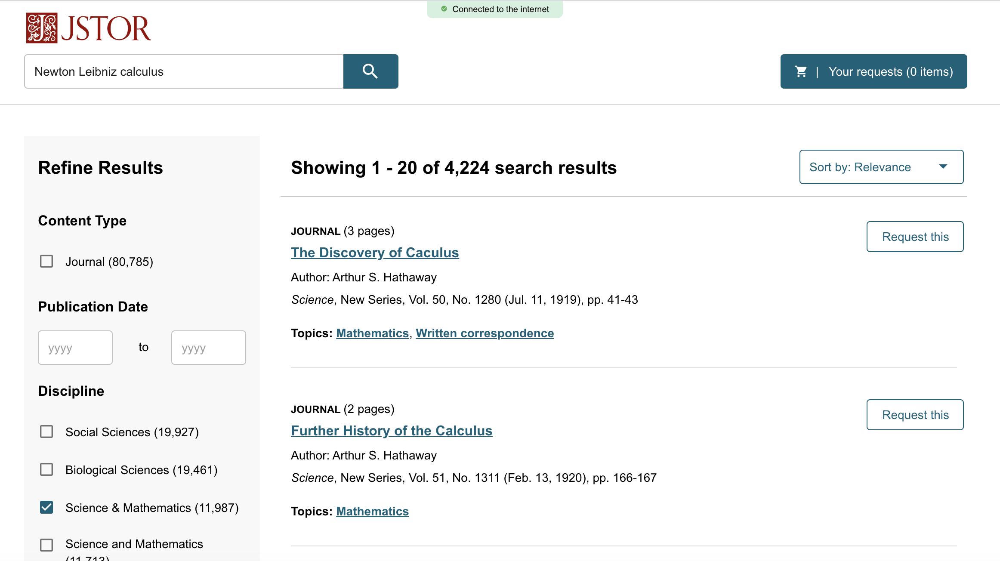

*The search results page for the JSTOR Offline Index*

### Build on Good Sources

If you have already received access to a copy of one or more sources that are a good fit, you can also take a look at the references the author has used in their research. The references are usually found at the end of an article or book. This is a good way to find related articles or books. You may also find that the same author has published and cited previous works on the same topic.

### Managing Information Overload

After you feel confident selecting search terms and constructing a search string, you’ll find yourself with a list of search results that might look great—or might be overwhelming. You might also find yourself with search results that are related to your topic, but are not specifically what you need. In this lesson, you’ll learn strategies for managing information overload, including:

- How to plan your research efficiently based on your project outline
- How to refine your search for a manageable set of relevant results
- How to document your sources so that they’re easier to access and use

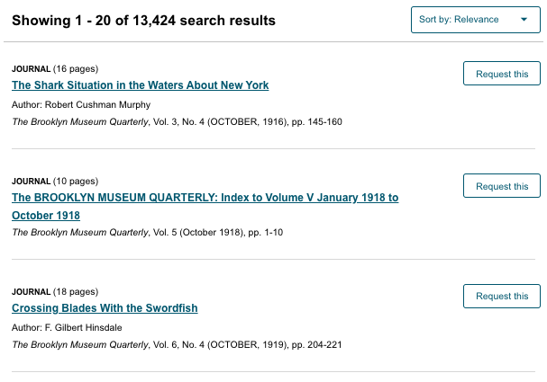

*Receiving too many search results can feel overwhelming. Follow the tips below for getting the most relevant results*

### Keep Project Goals In Mind

Before you begin the search process, be sure to review your project outline. Aligning your search with the project’s requirements will save you time in the long run. For example, if your assignment specifies that you use “recent” or “current” sources, you will probably want to narrow the dates on your search. That way, you won’t waste time reviewing resources that aren’t appropriate for your assignment.

Keeping your project outline at the forefront will also help you know when to stop searching for a specific subtopic and move on to other needed information. You’ll be most efficient if you stop when you have enough information to complete your work. 

### Your Search Results

When you’ve conducted your initial search, take a look at the results to get a sense of how effective your search string is.

_First, how many results are there?_ For example, if your search produces no results, or very few results, that may not be enough material for you to work with. With such a small set of results, you should also consider the possibility that you might be excluding some useful sources. If your search produces 15,000 results, on the other hand, it’s not realistic to think you’ll be able to review all of them to find the useful ones.

_Next, how relevant do the results seem at a glance?_ Have you put them in order by relevance? Scan through the results and see what pops out at you. Do they seem too technical, too broad, or just plain irrelevant? Are there terms that appear over and over — and if so, are those terms useful for your topic? 

Think of searching as *a process*, not an event. It’s pretty unusual to get a perfect, useful, relevant set of results from the very first search string you enter. 

Next, you’ll learn how to adjust your search to get a broader or narrower set of results.

### Narrowing Search Results

If you’re overwhelmed with search results, there are several ways to work toward a more useful and workable set of results.

First, double-check the construction of your search string. If you’ve used a set of quotation marks or a set of parentheses, make sure it’s closed correctly and encloses the intended terms. Make sure that any Boolean operators, like AND or OR, are capitalized.

Next, scan the first page or two of results and see how you might refine them. The JSTOR offline index includes options to **Refine Results** that allow you to be more specific about what results you want to see. Here are a few of the options available:

* **Content Type** You can choose between the type of materials such as between a journal article or a book chapter.

* **Publication Date** You can select results by a certain date. To look at only the most recent examples, you might only check materials published after 2010.

* **Discipline** You can narrow your search to publications in a certain field or discipline.

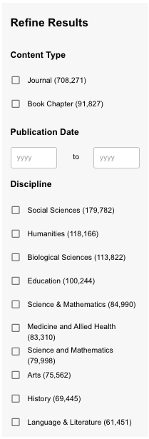

*The* **Refine Results** *pane helps you filter out articles that may not be useful for your research.*

After you’ve used **Refine Results** to narrow down your search, reassess the results and adjust your search string accordingly. Do you keep seeing a term or idea that isn’t relevant to your research? Do you see a term that is useful but isn’t in your search string? Using AND to add it to your search string will narrow down the current set of results.

You might also reassess the terms you’ve used. Is there a more specific version that’s likely to get you fewer results—and results that are more specific to your topic? A search for “opera singers” yields a lot of results, but a search for the more specific term “mezzo sopranos” brings up a much smaller set. 

Finally, think about adding terms that narrow the search by geography, time, or discipline. A search for surfing will give you a lot of results, probably too many to wade through. But, a search about surfing in Kauai, a search about surfing in the 1920s, or a search about the physiology of surfers will give you a much more focused, manageable set of results. 

If you’re using your best search skills and are still flooded with search results, it’s possible that your topic is just too broad.

### Too Few Results

If your search gives you fewer results than you had hoped or expected, you can make a few simple changes to your search string that will bring you a larger set of results.

First, rethink your terminology. If you’ve used a very specialized term, consider changing it to a broader term. For example, the specialized term “shin hanga,” a type of Japanese woodblock printing, yields a very small set of results. But the broader term “Japanese woodblock printing” gives you a much larger set of results to work with.

Second, consider minor adjustments to the way your search string is constructed. If you’ve connected two words using AND, think about changing the operator to OR, which will produce a larger set of results. You can also remove one of your search terms to increase the number of results.

Finally, try **truncating** a search term. Truncating is a way of reducing a word to its most basic part. This allows the database to pull up all of the forms of the word, instead of just the one you’ve entered. So a search for the truncated term child* will pull up results that use the words child, child’s, children, and children’s—whereas searching for children’s pulls up only the results that use the specific form of the word.

To truncate a search term, examine the search term you are using. What other variations of that word might be used in publications on the topic? Your goal is to reduce the word to its most basic form so that all of its other potential forms will come up in your search results. For example, if you’re looking for articles about how to teach music, use the truncated form teach* to include articles that use the words teacher, teachers, and teaching.

On the other hand, be aware that truncating a search term too much may bring in unrelated results. For example, if you are searching for information on staying in hostels, the truncated term host* will also get you results that discuss the unrelated topics of hostesses, hostages, and hostility. Truncating to hostel* will get you a more precise set of results about hostels, hostelry, and hostelers.

## Assessing Your Sources

Once you have received your research materials, it is important to assess whether they are trustworthy and credible. This section describes how to identify scholarly source material for academic research. 

There are several ways to identify scholarly source material, and a good place to start is by examining prospective sources for certain academic attributes. You can think of them as the A-B-Cs of scholarly sources.

These attributes are helpful in interpreting the level of scholarship. In the lesson ahead, we’ll look at sources and point out these attributes so that you can start to identify them on your own.

### Key Indicators
An easy way to remember the key indicators of academic scholarship is by using your A-B-Cs: **authority**, **bias**, and **content**. Let’s get started by investigating the topic of high-stakes testing.

#### Authority
To have authority means to be recognized as knowledgeable on a specific topic. There’s a root word in “authority” that tells you what you’re going to look at first: “author.” When you’re considering a source, try to find the answers to these questions: 

* Is the author or authors clearly identified? 
* Does the author have scholarly credentials, or credentials within the appropriate field of expertise? 
* Is the author’s affiliation apparent, such as where he or she works? If the author is a professor, are advanced degrees listed alongside his or her academic position? 
* Does the author have qualifications to write on the topic, such as an advanced degree in the field with several years of experience and research on the topic? 
* Does the publication have an author and an editor? The presence of an editor might imply a collection of articles, as opposed to a single piece by a single person. Be sure to note who the piece is actually written by. This should usually be a person in scholarly works with appropriate credentials. 
* Occasionally, an organization will serve as the author. In these cases, make sure that the organization has expertise and credibility in the field. You can usually determine this by reading the organization’s bio, the same way you would read about an author. 

Take a look at this excerpt from the sustainability journal *Consilience: The Journal of Sustainable Development*.

Page from *Consilience: Journal of Sustainable Development* demonstrating authorship.

You can see the authors clearly listed, along with their affiliations and contact details. All authors work at well-known institutions, and one is an assistant professor of public affairs. These are good indicators that they have authority on this subject.

#### Bias
It’s important that academic scholarship is presented in an objective manner without bias. The peer review system is an established way to identify biases that might appear in scholarly research. In peer review, a work is evaluated by experts and published only if it meets the discipline’s standards. It is also a way to ensure objectivity in assessing an academic article. The peers selected for the review are: 

* In the same field as the author(s) 
* Proven to be objective and independent from the work they are reviewing for publication 
* Familiar enough with the body of work the article relates to in order to lend credibility to the publication of it 
* Able to make a formal declaration in the work attesting to their neutrality 

In this view from the American Journal of Nursing, you can see a reference to peer review along with the information on what the journal stands for and what it looks for in the articles it publishes. The journal has greater authority because you can rely on its information being unbiased.

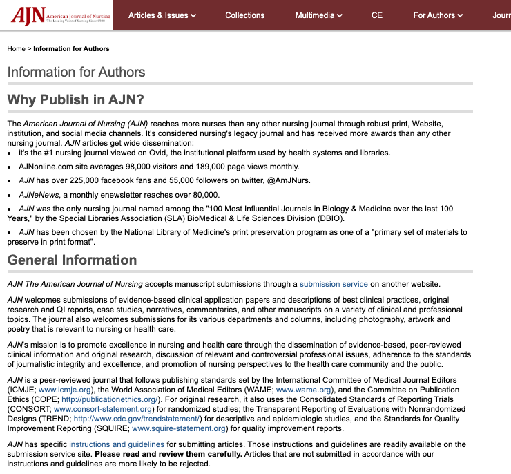

*American Journal of Nursing peer review process.*

#### Content
By examining the content, you can determine an article’s suitability for scholarly research. Remember to look not only for relevant topical information, but also signs of scholarship. Here are some questions to consider: 

* **Audience**: is the work intended for other scholars or experts in the field? Does it use discipline-specific terminology? 
* **Intent**: why is the author publishing the article? Is it a report, a case study, or an in-depth analysis of a specific topic? 
* **Level**: does the article assume some basic knowledge on the readers’ part? Is it written for peers, or to introduce the topic to laypersons? 
* **Style**: Are there illustrations, charts, and tables? If so, are they relevant to the content or are they “eye candy” meant to attract readers? 
* **Tone**: is it written using a professional tone and an academic style, or is it colloquial and casual, which is a sign it’s not scholarly? 

This excerpt from *The Elementary School Journal*, provides information on the source’s credibility. As a researcher, knowing that the article is credible is just as important as finding out what it has to say about high-stakes testing. The title of the journal, *The Elementary School Journal*, doesn’t tell us much about the level of content—but the subtitle of the article, “A Framework for Equitable Learning Opportunities,” gives us a clue that this article is aimed at readers with some knowledge in the field, not at the general public. The article is presented in plain text, without any illustrations. These are all good indicators of a credible scholarly source.

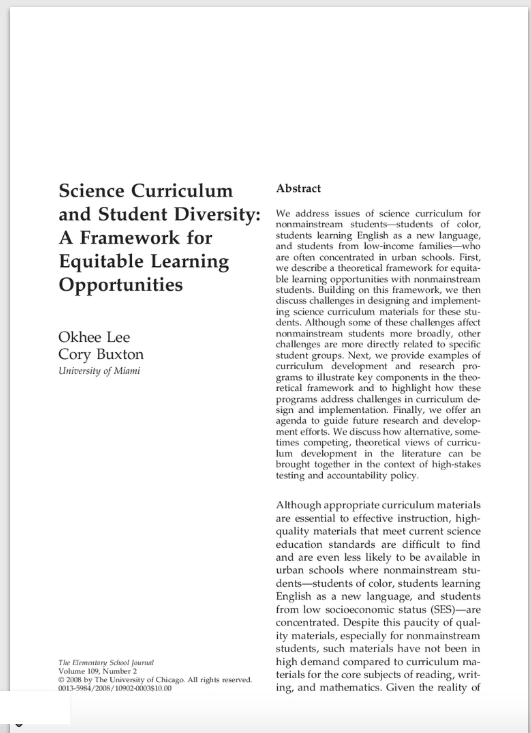

*The Elementary School Journal page excerpt demonstrating source credibility.*

 Finally, think about the tone of the abstract. Look at this sentence: 

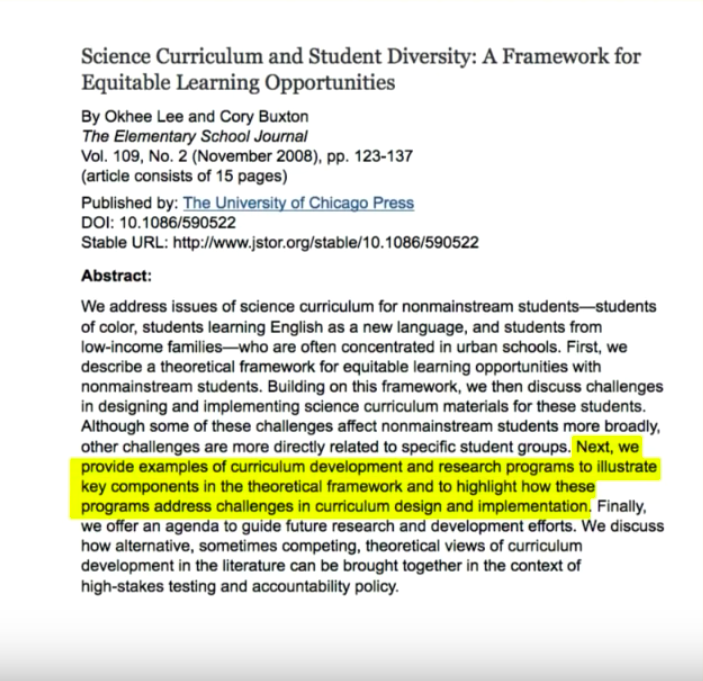

"*Next, we provide examples of curriculum development and research programs to illustrate key components in the theoretical framework and to highlight how these programs address challenges in curriculum design and implementation.*"

What are some words that describe the tone of this sentence? You might say it is complex, formal, or academic.

Now, look at this excerpt from another source on the topic of teaching science:

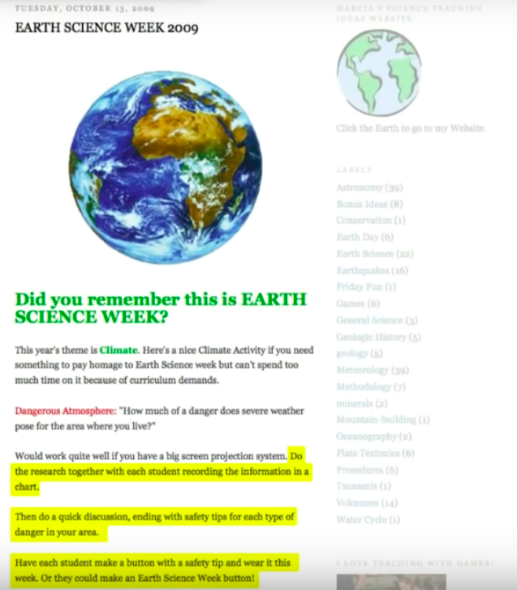

"*Do the research together with each student recording the information in a chart. Then do a quick discussion, ending with safety tips for each type of danger in your area. Have each student make a button with a safety tip and wear it this week. Or they could make an Earth Science Week button!*"

What are some words to describe the tone of this piece? You might say it is conversational, accessible, or straightforward. The casual tone of this writing is one clue that it does not come from a scholarly source.

#### Publisher
We’ve discussed authors and their content, so now let’s turn to the publisher that’s responsible for the end product. The publisher plays an important role in establishing credibility. Without a legitimate publisher, it’s difficult to confirm that a source is credible. When in doubt, look to the publisher to help steer you toward a credible source on which to base your scholarly work, and search for these clues: 

* Does the journal list an editorial board? 
* Is there a logo? 
* Has the journal won any awards? Is it affiliated with a well-known institution? 
* Is the blurb on the journal written in a scholarly manner for an academic audience? 

Within a scholarly database listing, you will usually find a link that offers information about a journal. Here’s an example from *Teaching & Learning Inquiry*, published by Indiana University Press. 

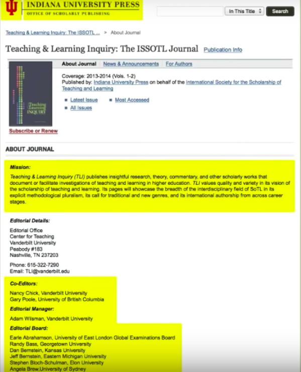

*Indiana University Press example of publisher information.*

A university affiliation is a good indicator of scholarly content. Notice whether there is a logo displaying the name. Information is included on its mission, editors, and editorial board. The tone is professional and the style is academic. 

#### Additional ways of identifying scholarly sources
Academic endorsement is an important indicator of scholarship. We’ll explore the signs of academic endorsement together, and you will learn how to recognize them on your own.

We’ll also tackle the concepts of relevance and currency in scholarship. You’ll learn why they are important, and how they are different.

#### Scan
No one can be expected to read everything while they’re searching for resources, so it’s important to practice the art of scanning. If there’s an abstract, scan for keywords: words or phrases that relate to your topic and provide clues about the content of the article. Pay attention to the A-B-C clues you see (authority, bias, and content). If there is no abstract, scan for author, publisher, and keywords. Keywords should not only relate to your topic, but also be of a scholarly nature.

Get into the habit of “talking to the text” as you scan, whether you’re looking at a computer screen or a piece of paper. Highlight important words and phrases, record questions or ideas that come up, and make notes about how this material might connect to other things you know.

If you were investigating the topic of high-stakes testing, what would you notice about the abstract and keywords for this article? 

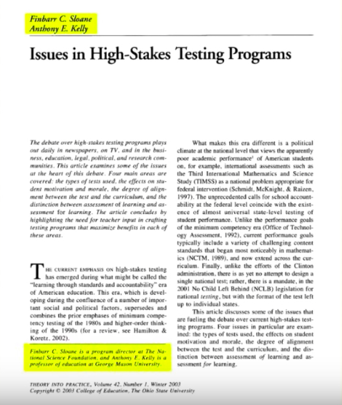

*The Elementary School Journal page excerpt demonstrating source credibility.*

As you scan this abstract, you might highlight the keywords “high-stakes testing,” which tell you that it relates to your topic. You might mark phrases like “qualitative metasynthesis” or “template analysis” with a question mark if you’re not sure what they mean. The use of these complex and specialized terms indicate that this is a scholarly source. Remember: 

* Abstract: If there’s an abstract, read it first, checking for key words and concepts. 
* Scan: Even if there isn’t an abstract, scan for keywords and formal language structure. 

#### References: Bibliography
Other signs of academic endorsement can be found by examining the work’s bibliography. Review your sources’ reference information to find signs of academic endorsement.

Look at the bibliography: is the article formulated from other scholarship? If there is no bibliography, that could be a sign that a source is not scholarly. 

#### Currency
Once you’ve determined that a work is scholarly, it’s important that you make sure the sources you use are also current and relevant. When you assess the currency of a source, you’re asking, “How new is this information? Has anything changed since this was published?” 

Here are a few clues that can help you decide whether a source is current. 

* Publication or revision date: does the source have one? If not, you really have no way to tell whether it’s outdated. A scholarly source should always include a publication date. 
* How recent are the publication dates of the works cited in its bibliography? If a new article cites only articles from 20 years ago, consider whether it might be omitting more recent sources. 
* Has the information been revised, updated, or retracted? Is newer information available? 
* Also consider your topic: is information about it still changing or being discovered,such as in the fields of medicine or technology? If so, you may want to look for only very current sources. On the other hand, if you are writing about an event in ancient history, it may be fine to use older sources. 

#### Relevance
The question of relevance is one that only you can answer: how useful is a source for your purpose?  

* Is it written at an appropriate level? 
* Is it too broad or too specific? 
* Does it answer a question or fill a need in your research? 
* Does it add something new? 

#### References: Citations
Check for citations within the text of the article. Have the authors backed up their statements with references to other scholarly sources? 

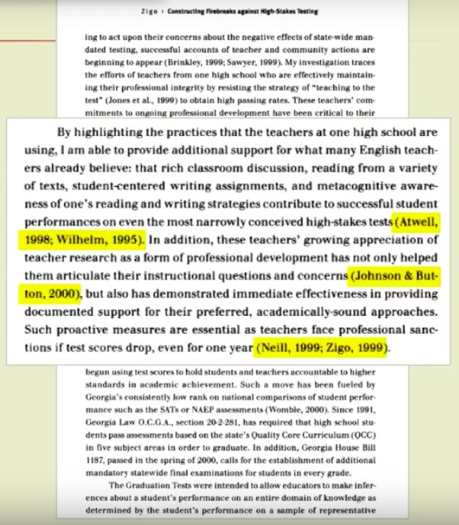

*Example of an article with citations in the text.*

You can see that this author is citing research that supports her statements. This tells you that her assertions are based on study in the field, and it indicates that other scholars share her views. This foundation is a good indicator of scholarly content. If the author provides no citations, it could be a sign that the source is not scholarly.

In many cases, you can also find out who is citing the source you’re looking at. If other scholars are using it as a source in their own research, that could be a sign of a well-respected scholarly source. This is called a “cited by search” or a “reverse citation search.” Many databases provide a link to this search from an article’s citation page. 

## Citing scholarly work: creating citations
You’re doing research for a paper on youth voting. You come across two articles that provide different numbers for how many young people voted in the most recent election. One source quotes a specific expert and includes a list of citations; the other source says that its numbers come “from a recent poll.” Which one seems like a more trustworthy source? Why?

Citing your sources means that you give credit for the ideas and information you’ve used in your paper. It builds credibility and helps readers understand where your ideas come from. 

In this lesson, you’ll learn: 

* What elements make up a citation 
* Where to find the necessary information for a citation 
* How to compose your own citations 

### Why Cite?
Citing your sources serves you, and it serves your readers. When you provide citations for the work you’ve used in your paper, it gives readers a way to follow up and find more information on a topic. A good citation points your readers directly to the source. 

Using proper citation also gives you credibility as an author. It allows readers to distinguish between your ideas and those of your sources.

### Citation Styles
There are a variety of ways to format citations. Citation styles are issued by the major professional organizations in a discipline or field. The citation styles are published in books called style guides. For example, the Modern Language Association, or MLA, has its own citation style that is often used for papers on language, literature, and the humanities. MLA is one of the most common styles used in high school. You may also be asked to use APA style, issued by the American Psychological Association. There are also special citation styles for medicine, legal writing, and journalism that you may encounter in college. If you’re unsure which citation style to use, check your assignment or ask your teacher.

Most citation styles include the same basic pieces of information, but may require that the order or format of those pieces be a little different. For example, some styles use full first names, while others use just a first initial. Some styles capitalize every word of a title, and some capitalize only the first word. Depending on the style, you may use a period after each piece of information, or a comma between some of them. You may need to use a single space, or you may need two spaces. These are small details, but it’s important to pay attention to them as you create your citations. Formatting your citations correctly and consistently tells your readers (and your instructor) that you understand the conventions of academic writing.

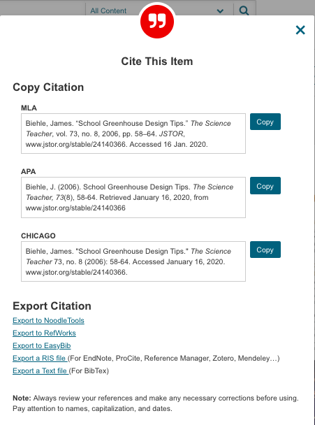

Here, you can see the MLA, APA and Chicago-style versions of citations for the same article.

### Elements of a Citation: Print
Print materials include books, popular magazines, and articles from scholarly journals. A complete citation for a print source will point your readers to the exact source you used — including the correct edition number, page number, or format.

Common elements of a citation include: 

* The author’s name: Who wrote the work? Usually this is a person or multiple people,but sometimes the author is an organization or institution. 
* Title: What is the exact title of the work? If it appears within a larger work—like an article in a journal or a chapter in a book—what is the title of the larger work? 
* Publication date: When was the work published? Are there multiple editions or revisions? If more than one date is given, use the most recent one in your citation. 

For both books and journal articles, MLA style requires the author’s name, the publication title and/or article title, the publication date, and the format, such as print or web. 

Books also need the place of publication and the name of the publisher. If more than one place is listed, use the first one in your citation. Articles need volume, issue, and page numbers.

If you use a library database to download a book or article originally published in print, you must include the name of the database you used, the medium (the web, rather than print), and the date you accessed the material.

### Collecting Citation Elements
So, where do you start finding the elements of a citation? When you’re looking at a book, you can find most or all of these elements at the beginning of the book, on the title page and the copyright page. 

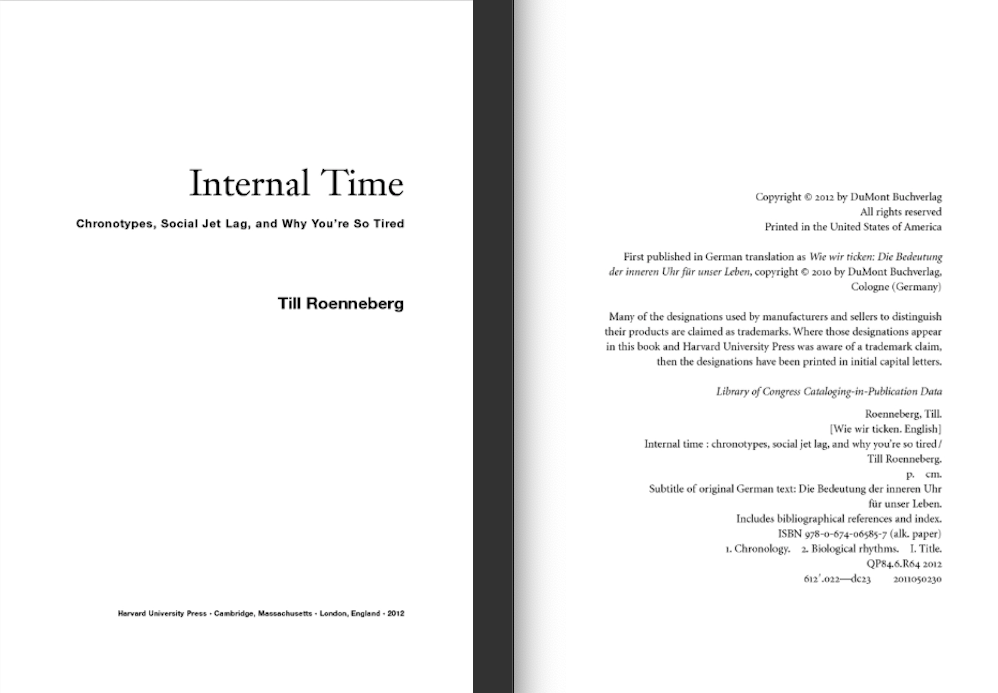

*Example of a book showing front and back matter.*

If you’re looking at a journal article, you can usually find information at the top and bottom of the page, and at the beginning or end of the article. 

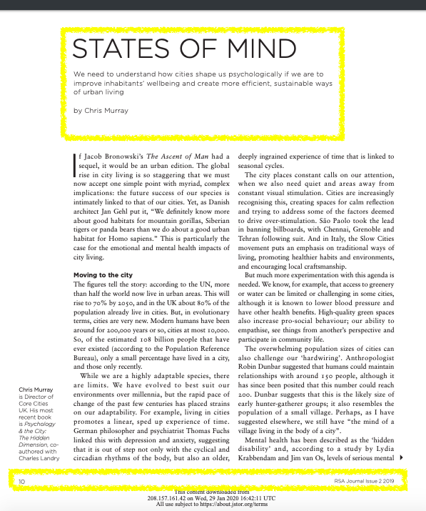

*Example of a journal page showing citation information.*

The best time to find and record this information for a book or journal is at the beginning of your research process. When you’re searching a database, you can find a complete citation for each search result. Keep all of this information with your notes for later use. 

Some databases will also generate a citation in your desired format. Also, consider using citation management software to track your sources as you go. Some citation management programs are free, and your school may subscribe to others. Ask your teacher or librarian about the best citation manager to use. 

### Composing a Citation
When it’s time to put together your citations, you’ll need the information you’ve gathered about your sources — but you’ll also need information about what is required for a particular citation style. Your library or teacher should have a copy of the style guide you need or the online version of the style guide.

Using your style guide as an example, plug in the information from your source material, making sure that all the elements are present. Double-check to be sure you’ve used capital letters, italics, and punctuation exactly as your style guide specifies.

#### Examples: Print and Database Sources
Now that you know where to find the information needed for a citation and how to compose one, let’s take a look at some examples.

Here’s the database information for an article on the writing of the Brontë sisters. This excerpt includes all of the necessary elements of a citation: author, article title, journal title, volume and issue number, publication date, and page numbers.
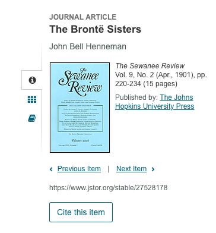

Now, look at how these elements appear in an MLA and an APA citation. Most of the same elements are present in both citations, but you can see that the citations look different: the pieces are in a different order, some items (like the author’s name) are formatted differently, and different words are capitalized.

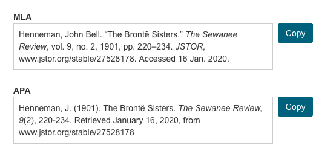

### Citing and paraphrasing a scholarly work

Now that you understand the elements of a citation, it’s time to take a look at how to incorporate citations into the main body of an academic paper. 

In this lesson, you will: 

* Gain an understanding of when and what to cite in your work 
* Learn the difference between quoting, paraphrasing, and summarizing your sources 
* Learn how to cite sources within the body of your paper 

### When to Cite
When do you need to cite a source? Each time you incorporate someone else’s information or idea into your own work, you must provide a citation. So, even if you are using your own words to describe another person’s idea, it’s still necessary to cite.

It’s not always necessary to cite facts that are broadly known and accepted. These kinds of facts are called “common knowledge.” For example, you don’t need to provide a citation for the statement that Washington, D.C. is the capital of the United States. This is a widely known fact that can be confirmed in a variety of sources, and it’s something that a good part of the population knows. 

But you would need to cite a statement that the population of Washington, D.C. was 601,723 in 2010. This number is not common knowledge that most people would be aware of. Providing a citation here tells the reader whose statistics you are using.

There’s no one set of guidelines about what information constitutes “common knowledge” and therefore does not need to be cited. Many experts recommend seeing whether a piece of information is available from a variety of sources. If it’s published in a number of places, it’s more likely to be common knowledge.

Common knowledge also varies between different groups. Think of your audience and ask whether this piece of information is something most of them already know.

If you are unsure about whether a citation is necessary, it’s always better to provide one. It’s much better to cite too heavily than to run the risk of plagiarism.

### Plagiarism
Plagiarism is the use of another person’s words or ideas without providing proper credit. When you think of the word “plagiarism,” you might think of someone downloading a paper from the Internet or copying a classmate’s work. But plagiarism is often not intentional, and it’s much broader than just copying someone else’s work. It can be as simple as: 

* Failing to include a citation for an idea you’ve restated in your own words 
* Paraphrasing in language that is too close to the original, or 
* Forgetting to put quotation marks around content from another writer’s work 

As a writer, you are responsible for avoiding plagiarism — and there’s really no room for accidents. It’s essential to be conscious of giving credit to your sources. 

Remember: When in doubt, cite. 

### Quoting, Paraphrasing, and Summarizing
There are different ways to use information from your sources in your own writing. 

* **Quoting** is the most straightforward: you use another writer’s words exactly as they appear in the source material. When you quote a source, you must enclose the quoted material in quotation marks. This gives readers a visual cue that these are not your own words.

* **Paraphrasing** means stating someone else’s idea in your own words. When you paraphrase, you don’t use quotation marks, so it is essential to reword significantly enough that the wording and sentence structure are your own.

* **Summarizing** is writing your own description of a larger work or a body of ideas. As with paraphrasing, a summary needs to be your own words. No quotation marks are used here, so it’s very important to distinguish your writing from the source’s.

Whether you’re quoting, paraphrasing, or summarizing information from a source, you must provide a citation.

### In-Text Citations
In general, a citation has two parts: a brief mention of the source within the body of the paper, and a more detailed list at the end of the paper, called a Works Cited page. Here, we’ll be talking about the former type, which are called in-text citations.

In MLA and APA styles, an in-text citation is a brief mention of the source that appears within a set of parentheses. In-text citations follow quotations, paraphrases, and summaries that appear as part of your text. MLA uses the author-page style of citation, which consists of the author’s last name plus the page number where the quote or idea appears in the source material. 

Sometimes it makes sense to incorporate the author’s name into the sentence itself. This is fine to do, but you always need to include a page number in parentheses for print sources. The purpose of this citation is to tell the reader that the quote comes from page 23 of a publication by an author named Harris. If the reader wants to know more about this publication, she can look at the Works Cited page at the end of the paper, which will include a complete citation for this source.

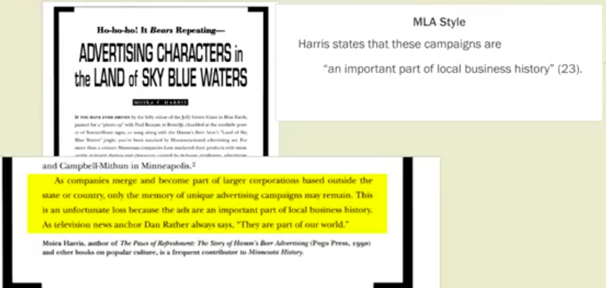

*Example of an in text MLA style citation.*

APA style uses the author-date style rather than author-page, so an APA citation includes the author’s last name and the year of publication. This citation looks slightly different, but it serves the same purpose: it gives the reader the information she needs to find a more detailed citation at the end of the paper.

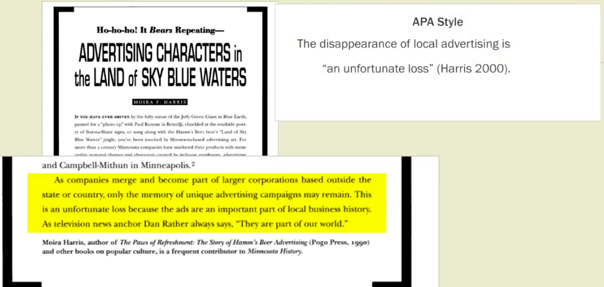

*Example of an in text APA style citation.*

### Offset Citations
Sometimes you will need to use a longer quotation as a part of your work. Rather than being inserted into the rest of the text, longer quotations should be indented to make the distinction clear to the reader. You can refer to a style guide, a book or online source devoted to the citation style you are using, to find the cutoff for when to indent, or offset, a quotation. In MLA style, offset a quotation when it makes up four or more lines of text.

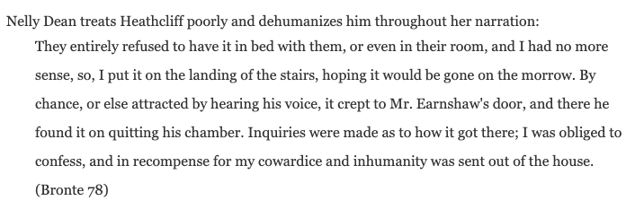

*Example of an offset citation in MLA style.*

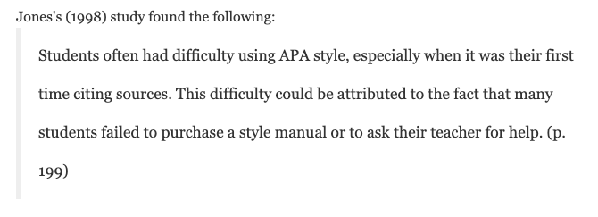

*Example of an offset citation in APA style.*

Notice that when you offset a quotation, you don’t use quotation marks around it. In this case, the formatting provides a clue to the reader that this is quoted material.

If the quoted material makes up less than four lines of text, it should appear as part of a normal paragraph, even if multiple sentences are quoted.

## Creating your Works Cited or Bibliography page for your research paper

Now that you know how to create citations and how to cite your sources within the body of a paper, it’s time to create the remaining piece of your citation system: a list of complete citations that appears at the end of your paper. 

In this lesson: 

* You’ll learn how to create a Works Cited page. 
* You’ll learn how Works Cited differs from a bibliography. 
* You’ll also learn how to use notes to provide your readers with additional information. 

### Tracking Your Sources
Now you’ve learned how to find and collect the elements necessary for a complete citation. Having all of this information handy will make it much simpler to compile your Works Cited page. There are several ways to keep your sources organized as you do your research: 

* Fill out a note card for each source. Each card should include a complete citation for the source, and you can also use it to make notes about how the source is useful for your paper. 
* Create a research log: a word-processing document or spreadsheet that lists each source, along with your notes. 

Use whatever method is most efficient for you. If you’re having trouble tracking down a piece of information you need for a citation, ask your teacher or librarian for help.

### Works Cited
As you know, in-text citations tell the reader which ideas and facts come from your source material. At the end of your paper, you’ll include a comprehensive list of all the sources you’ve cited. In MLA style, this section is called Works Cited. APA style calls it the References section. In this lesson, we’ll use these terms interchangeably.

In MLA and APA style, references are listed alphabetically by author. In other styles that use numeric citation, the list of references will be numbered in the order they’re cited within the text. In both cases, the goal is that readers can see a citation within the text and refer to the Works Cited page to get the full information about the source used.

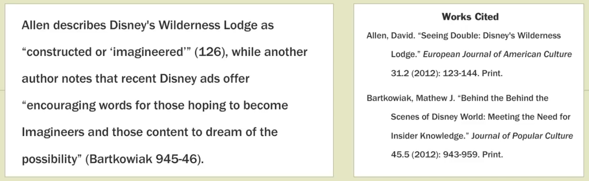

*Example of a works cited page in MLA style.*

Here’s an important note: If a source is cited in your paper, it must be listed in the Works Cited. The opposite is also true: Every source included in your Works Cited must be cited somewhere in your paper.

#### Creating Your Works Cited Page
To create your Works Cited page, add sources to the page as you cite them. This means that you’ll be transferring your source information from your note card, or research log document. As you add sources to your Works Cited page, be sure that: 

* Citations are formatted according to your style guide
    * All the necessary elements of each citation are present 
    * Punctuation, capitalization, and italics are used in keeping with your style guide 

* Every in-text citation has a corresponding entry on the Works Cited page 

Organize your citations in alphabetical order by the author’s last name. If you’ve cited more than one source from the same author, alphabetize those sources by title. For entries following the first one, you’ll replace the author’s name with three hyphens.

### Works Cited vs. Bibliography
You’ve probably heard the word “bibliography” used to talk about a list of citations. It’s important to note that a bibliography is not the same as a Works Cited page. 

As we’ve discussed, a Works Cited page is a list of the sources cited within the text of your paper, and only those sources. It does not include notes, and it’s formatted as a single alphabetical list. 

A bibliography is broader and more extensive; it’s a list of every source you used while researching your paper, whether or not you cited them specifically within the paper. Bibliographies may contain notes about the sources listed, and they may be split into subsections based on subject.

In academic work in some cases, you may not be asked to prepare a bibliography. If you’re not clear on what your teacher is asking for, be sure to get more detail about what’s expected of you. You don’t want to do the extra work to prepare a bibliography unless it’s required.

### Endnotes and Footnotes
What if there’s a great article on your topic that you didn’t cite, but you think your readers would be interested in? You can do this by including notes in your paper. Notes are a way to provide additional information and suggestions for further reading. You will see them used in the articles you read in your research. And if you aren’t using them in your writing now, you may use them in future course work.

A note has two parts: a superscript number within the text of your paper, and a corresponding entry in a numbered list. Within the text, use a superscript number to indicate each note. The text of the notes themselves can appear on a separate page at the end of your paper—these are called endnotes. Or, the notes can appear on the same pages as the superscript numbers—these are called footnotes. MLA style prefers endnotes rather than footnotes.

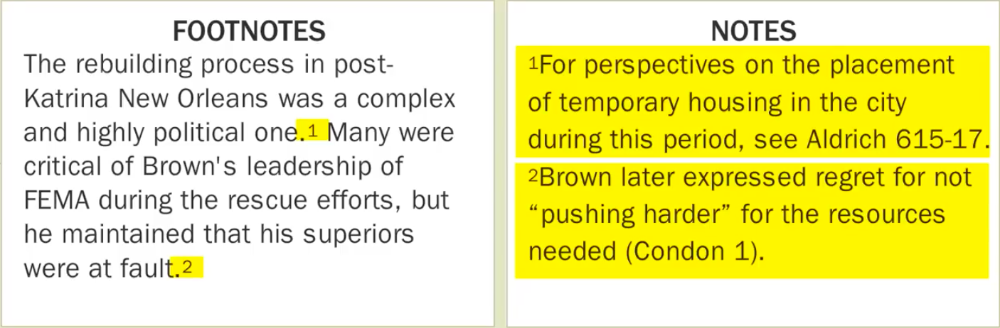

*Example of footnotes and endnotes.*

You might want to use a note to point readers to further articles on a topic; these are called bibliographic notes. Or you might use a note to give additional information about a statement; these are called content notes.

Remember that notes are optional and should be used sparingly, if at all. If notes are overused, you run the risk of overwhelming your reader with information, or distracting her from the main flow of your ideas.
