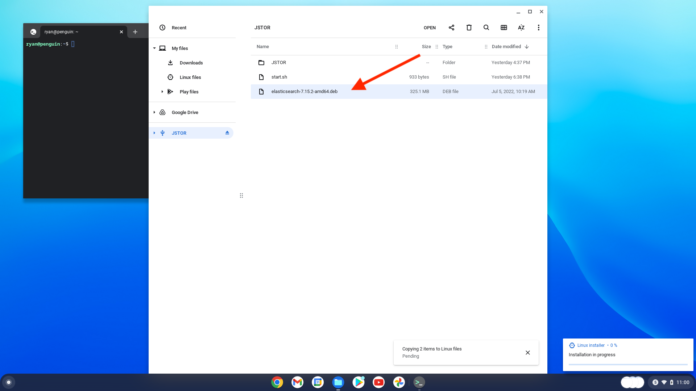

# JSTOR Access in Prison Initiative

## Chromebook Installation Guide

1. In the settings menu, select Advanced>Developers.
    
2. In the card for Linux Development Environment, select Turn On.
    
3. When prompted to set up the Linux development environment, select Next.
    

4. Choose a username and set a disk size of 35GB, then select Install. Make a note of the username you selected. 
    
    The installation may take several minutes.
    
     Once the installation is complete, a terminal window will appear. You can close or ignore that for the moment. Open the Files app. You'll notice that there is now a new space for "Linux files."
    
5. Plug in the usb drive provided by JSTOR. Drag all the files on the drive over to Linux files, except the one that begins with "elasticsearch-." 
    ````
    Chromebooks can be a little finicky about transferring files. You may note that the time remaining for the transfer swings wildly from several minutes to hundreds of hours. Don’t worry. It’s typically less than an hour. You may want to make sure the computer is plugged in and active during this process (see the guide below for instructions on keeping the chromebook from sleeping during the transfer). It can take a while, and you don’t want to have any errors. If you do, delete the files and start again.
    ````
    
6. While the files are transfering, let's install Elasticsearch! Double click the file that begins with "elasticsearch-" to begin the installation. You'll be prompted to move forward. Click "Install" then click "OK."
    
    
    
    The progress monitor for the Elasticsearch installation may show 0% and not move. That’s okay! When it’s done, the progress monitor will disappear.
    
7. After the file transfer is complete, you can open the Terminal again. If you left the Terminal window open after step 4, you can disregard this step. Open the Terminal app and select Penguin. 
    
    

8. In the Terminal, enter the following commands, and hit enter after each one (replace username in the second command with the username you chose in step four, which is also visible in the Terminal prompt). In the screenshot below, the username is "ryan".:
    ````
    chmod +x ~/init.sh
    sudo ~/init.sh -u username
    ````
    
9. You're almost done! Just close the terminal, and then re-open it, using the process described in step 7. After a moment, you'll see some text appear. It will take a couple of minutes to run through the initialization process. At the end, you'll see a note that an http server has started on port 1323.
    
10. Open a browser and enter the following for the URL:
    ````
    localhost:1323
    ````
    

11. You're now ready to use JSTOR!
    

## How to keep your chromebook awake during file transfer
1. Make sure your chromebook is plugged in and charging.
2. In the settings menu, select Device>Power.
    
3. From the dropdown next to "While charging," select "Keep display on." That's it!
    


